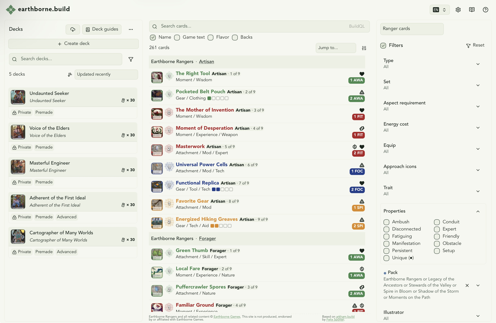

# earthborne.build

> `earthborne.build` is an Earthborne Rangers deckbuilding app derived from `arkham.build`.



## Overview

This repository is an `npm` workspace with three packages:

- `frontend/`: React + Vite single-page app
- `backend/`: Hono-based Node.js API backed by SQLite
- `shared/`: shared schemas, DTOs, and helpers

The current backend serves Earthborne Rangers card, pack, and card set data, local image delivery, fan-made project metadata, local deck sharing, and a public directory of decks shared by users. The frontend still contains some upstream `arkham.build` integration code paths; features such as remote sync and provider auth are not available in a self-hosted deployment.

## Requirements

- Node.js `24.x`
- `npm`
- A local clone of `https://github.com/zzorba/rangers-card-data` for card ingestion

## Common commands

```sh
# install workspace dependencies
npm install

# lint / format
npm run lint
npm run fmt

# frontend
npm run dev -w frontend
npm run build -w frontend
npm run test -w frontend
npm run check -w frontend

# backend
npm run dev -w backend
npm run test -w backend
npm run check -w backend
npm run db:migrate -w backend
npm run ingest:cards -w backend
npm run download:images -w backend

# shared
npm run test -w shared
npm run check -w shared
```

## Development flow

1. Copy `backend/.env.example` to `backend/.env`.
2. Clone `rangers-card-data` somewhere on disk.
3. Run `npm install`.
4. Run `npm run db:migrate -w backend`.
5. Run `CARD_DATA_DIR=/path/to/rangers-card-data npm run ingest:cards -w backend`.
6. Optionally run `IMAGE_DIR=/path/to/cards SQLITE_PATH=./backend/earthborne.db npm run download:images -w backend`.
7. Start the backend with `npm run dev -w backend`.
8. Copy `frontend/.env.example` to `frontend/.env`.
9. Start the frontend with `npm run dev -w frontend`.

## Documentation

- [docs/architecture.md](./docs/architecture.md): current app architecture
- [docs/api.md](./docs/api.md): backend endpoints and env vars
- [docs/deployment.md](./docs/deployment.md): self-hosted deployment guide
- [docs/metadata.md](./docs/metadata.md): card data sources and normalization
- [docs/translations.md](./docs/translations.md): frontend translation workflow
- [docs/adaptation-plan.md](./docs/adaptation-plan.md): historical notes from the `arkham.build` adaptation
- [docs/rules-reference-retrospective.md](./docs/rules-reference-retrospective.md): how the embedded `/rules` reference was built
- [docs/card-data-issues.md](./docs/card-data-issues.md): known card data quirks
- [docs/scraper-caching-plan.md](./docs/scraper-caching-plan.md): implemented scraper response caching design
- [AGENTS.md](./AGENTS.md): onboarding doc for AI agents working in this repo
